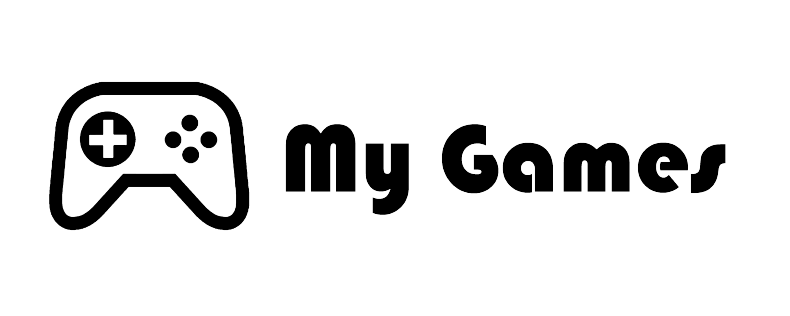

<p align="center"><a></a></p>


# MyGamesDRA22

En este proyecto se desarollará una aplicación con Angular haciendo uso de la [API de FreeToGame](https://www.freetogame.com/api-doc).

## Running Docker-compose.yml

To run the Docker-compose file 

```bash
  docker-compose up -d
```

## Run Locally

Clone the project

```bash
  git clone https://github.com/ualdra/mygamesdra22.git
```

Go to the project directory

```bash
  cd mygamesdra22
```
## Running Docker-compose.yml

To run the Docker-compose file will run

```bash
  docker-compose up -d
```
